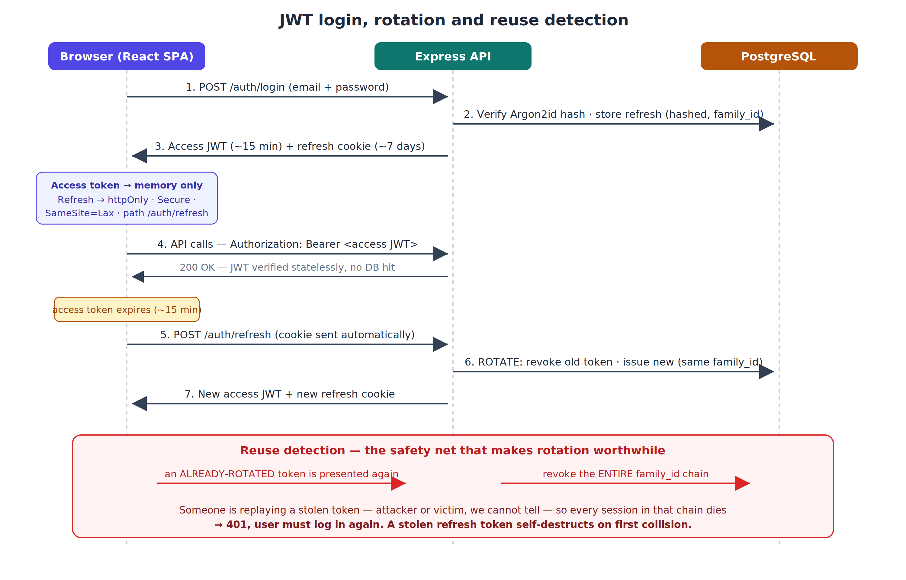
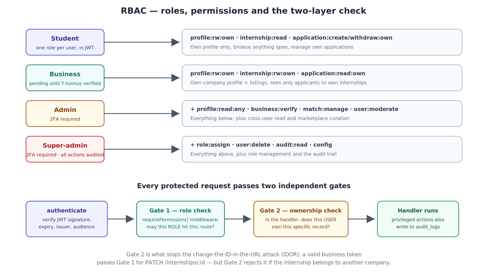
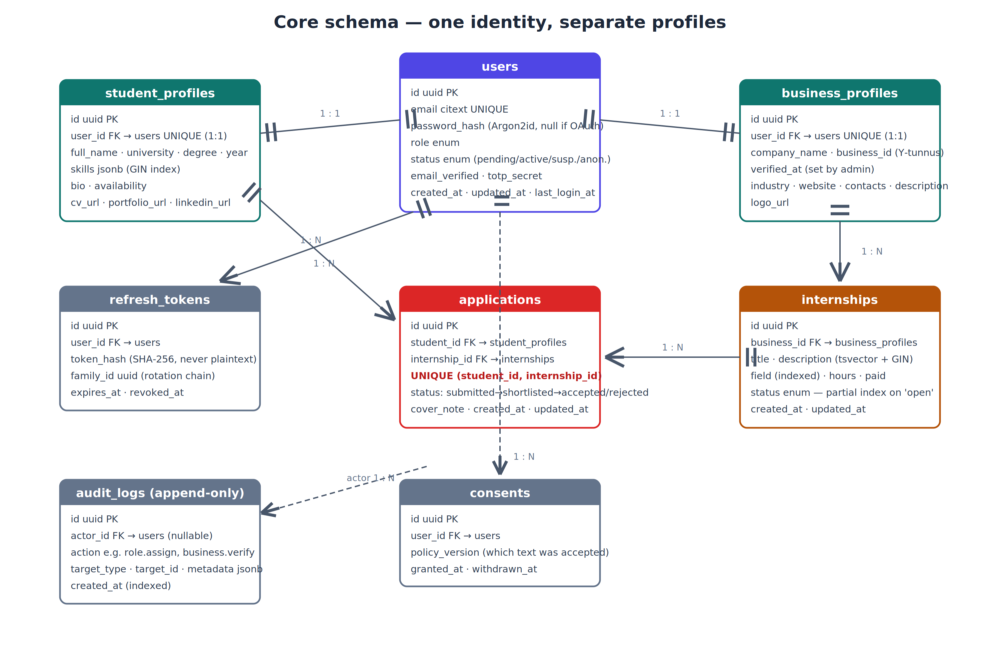
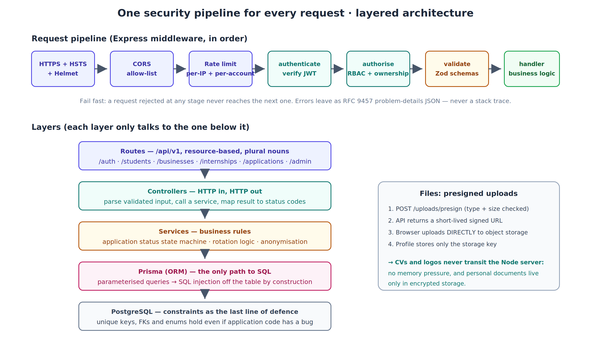

# Outtern — backend architecture proposal

R&D deliverable, Sprint 1 · Khun Htet Lin Aung · 15 June 2026 · v2.2 (draft)

This is my proposal for the backend of the internship marketplace: authentication, authorisation, database, API design and data protection, plus a short section on running it. The assumed stack is Node.js with Express behind a separate React + Vite frontend.

> **On scope.** Sprint 1 is research, so this proposes the full picture and the reasoning behind each choice — but it does *not* all get built at once. Items tagged **⌛ later sprint** are deliberately noted now and scheduled for after the core is working; the aim is to prove the choices hold up end to end, not to lock every detail before the first line of code. The build order is in section 7. Foundations to ship first are tagged **▶ Sprint 2**.

## Recommendations at a glance

| Area | Recommendation |
|------|----------------|
| Authentication | JWT. Short-lived access token kept in memory, rotating refresh token in an httpOnly cookie, with reuse detection. OAuth (Google/Microsoft) as an optional extra. |
| Authorisation | RBAC with 4 roles, checked in Express middleware, plus ownership checks in handlers. |
| Database | PostgreSQL with Prisma. Explicit indexes for search and the JSONB skills column. |
| API | Versioned REST under `/api/v1`, one shared security pipeline, RFC 9457 error format, OpenAPI spec generated from the validation schemas. |
| Files | Presigned uploads straight to object storage, so files never pass through the API server. |
| Operations ⌛ | Structured logging, health checks, CI tests, backup restore-tests — noted now, built as the system matures. |
| Data protection | Argon2id password hashing, TLS, encryption at rest, and a GDPR baseline with an actual retention schedule. Erasure is done by anonymising, not deleting rows. |

## Users

| Actor | Does |
|-------|------|
| Student | Profile, browse + apply to internships. |
| Business | Company profile (Y-tunnus), post internships, view applicants. |
| Admin | Verify profiles, run matching, moderate. |
| Super-admin | Manage admins, assign roles, audit logs. |

---

## 1. Authentication

### Options I compared

| Approach | Pro | Con |
|----------|-----|-----|
| Session | Instant revoke, simple. | Needs a shared store to scale; cookie-bound. |
| JWT | Stateless, scales, fits a separate frontend. | Hard to revoke before expiry. |
| OAuth | Low friction, no password to store. | Provider dependency. |

### My recommendation: JWT with rotating refresh tokens, OAuth optional

- Access token: a JWT of roughly 15 minutes, carrying the user id and role. Sent as `Authorization: Bearer` and kept in memory only.
- Refresh token: roughly 7 days, stored in an httpOnly + Secure + SameSite=Lax cookie, path-restricted to `/api/v1/auth/refresh`, and revocable on the server.

Why Lax rather than Strict: Strict blocks the cookie on every cross-site navigation, which would quietly break our own OAuth callback and any "log in via email link" flow. Lax still blocks cross-site POSTs, and that is the actual CSRF attack vector. Writes get a CSRF token on top of that anyway.

The usual complaint about JWTs is that you can't revoke them. The refresh token is the answer. A stolen access token is only useful for about 15 minutes, and anything longer-lived has to go through `/auth/refresh`, where the server can say no.

Rotation and reuse detection: every refresh issues a new token and invalidates the old one, and all tokens from a single login share a `family_id`. If a token that has already been rotated ever turns up again, two parties are holding copies. We can't tell whether the current request is the attacker or the victim, so the whole family is revoked and the user has to log in again. This is what actually makes the 7-day window safe. Rotation without reuse detection is mostly theatre.

*Trade-off worth naming: revoking the whole family is the safe response, but it can occasionally log a user out for an innocent reason — a flaky connection that retries a refresh can look like reuse. I think that's an acceptable price for the security, but it's a real edge case, not free.*

OAuth users get issued the same Outtern tokens after the callback, so nothing downstream cares how someone logged in.


*Figure 1 — JWT login, rotation, and reuse-detection flow*

### Email verification

Registration creates the account with `status = pending` and `email_verified = false`, then sends a single-use expiring link (a random 256-bit token, stored hashed). Pending accounts can log in but can't apply or post until verified. Password reset reuses the same token pattern.

### Abuse controls

| Control | Detail |
|---------|--------|
| Rate limiting | Per-IP and per-account on `/auth/login` and `/auth/refresh`. |
| Lockout | Progressive delays after repeated failures rather than a hard lock. A hard lock would let anyone lock a victim out of their own account just by spamming bad passwords at a known email. |
| Generic errors | Always "invalid email or password". Saying which half failed lets attackers enumerate which emails have accounts. |
| Admin accounts ⌛ | TOTP 2FA for admin and super-admin (⌛ later sprint — admin tooling comes after the core). They can read everyone's personal data, so they're the most valuable accounts to steal. |
| Secrets | Signing secret lives in env or a secrets manager, never in the repo. Tokens carry `iss`, `aud` and `exp`, all verified. |

Tokens never go in localStorage. Anything in localStorage is readable by any JavaScript on the page, so one XSS bug hands the token to an attacker. Memory plus an httpOnly cookie avoids that.

---

## 2. Authorisation

I'm proposing plain RBAC: one role per user, the role maps to permissions, and the check happens before anything runs. I looked at ABAC as well but it earns its keep when access depends on lots of attributes (department, time, resource tags). Our rules reduce to "what role are you" and "do you own this record". Two checks. If per-resource sharing ever appears we can revisit.

| Role | Permissions |
|------|-------------|
| Student | Read/edit own profile; browse internships; create/withdraw own applications. |
| Business | Read/edit own profile; create/edit/close own internships; view own applicants. |
| Admin | + read any profile, verify businesses, run matches, moderate. |
| Super-admin | + assign roles, delete users, audit logs, config. |


*Figure 2 — Role-to-permission mapping*

Two layers of checking:

- Role level: middleware checks whether the role in the JWT is allowed to hit this route at all.
- Ownership: the handler checks the user actually owns the record it's about to touch.

The second layer matters because role checks alone can never stop the change-the-ID-in-the-URL bug (IDOR). An attacker with a perfectly valid business token passes every role check for `PATCH /internships/:id`. The ownership check is what rejects them when the internship belongs to someone else.

```js
const permissions = {
  student:     ['profile:rw:own','internship:read','application:create'],
  business:    ['profile:rw:own','internship:rw:own','application:read:own'],
  admin:       ['profile:read:any','business:verify','match:manage','user:moderate'],
  super_admin: ['role:assign','user:delete','audit:read'],
};

function requirePermission(perm) {
  return (req, res, next) => {
    if (!resolve(req.user.role).includes(perm))   // role from verified JWT
      return res.status(403).json({ type: 'about:blank', title: 'Forbidden', status: 403 });
    next();
  };
}

router.post('/internships', authenticate, requirePermission('internship:rw:own'), createInternship);
```

Business verification: new business accounts start as `pending`. An admin checks the Y-tunnus (the PRH open API can help here) and flips them to `active`. A pending business can prepare drafts but can't publish, which keeps fake companies away from students from day one.

Audit trail ⌛: every privileged action (role change, verification, deletion, match decision) writes a row to `audit_logs`. The table is designed now; wiring it onto every privileged route is a later-sprint task once those routes exist. That's a security control and it's also the evidence GDPR's accountability principle asks for. Schema is in the next section.

---

## 3. Database

### PostgreSQL vs MySQL

| | PostgreSQL | MySQL |
|--|-----------|-------|
| Integrity | Strict, rich constraints. | Solid, more lenient. |
| JSON | Native JSONB, indexable (GIN). | Weaker. |
| Full-text search | Built-in, good. | Weaker. |
| Hosting | Supabase, Neon, Railway, Render. | Widely hosted. |

I'd go with PostgreSQL and Prisma. MySQL would work too, honestly, but this schema leans on exactly the things Postgres is stronger at: indexable JSONB for skills tags, built-in full-text search for listings, and strict constraints. Prisma gives us type-safe queries and managed migrations on top.

### Design: one identity, separate profiles

One `users` table handles login and role. Role-specific data lives in separate profile tables joined 1:1 to `users`. Students and businesses share almost no fields, so a single wide table would be half NULLs. The split also keeps the auth-critical table small and makes GDPR erasure much cleaner (see section 5).


*Figure 3 — Core schema*

**users**

| Column | Type | Notes |
|--------|------|-------|
| id | uuid PK | |
| email | citext, unique | Case-insensitive, so capital letters can't dodge the uniqueness constraint. |
| password_hash | text | Argon2id; null for OAuth-only accounts. |
| role | enum | student/business/admin/super_admin. |
| status | enum | pending/active/suspended/anonymised. |
| email_verified | boolean | |
| totp_secret | text, nullable | Encrypted; admins only. |
| created_at / updated_at / last_login_at | timestamptz | |

**student_profiles**

| Column | Type | Notes |
|--------|------|-------|
| id | uuid PK | |
| user_id | uuid FK, unique | → users |
| full_name, university, degree_programme | text | |
| study_year | int | |
| skills | jsonb | GIN index, so tag queries are index lookups rather than table scans. |
| bio, availability | text | |
| cv_url, portfolio_url, linkedin_url | text | Object-storage keys, not files. |

**business_profiles**

| Column | Type | Notes |
|--------|------|-------|
| id | uuid PK | |
| user_id | uuid FK, unique | → users |
| company_name | text | |
| business_id | text | Y-tunnus, format-validated and admin-verified. |
| verified_at | timestamptz, nullable | Set by admin verification. |
| industry, website, contact_name, contact_phone, description | text | |
| logo_url | text | Object-storage key. |

**internships**

| Column | Type | Notes |
|--------|------|-------|
| id | uuid PK | |
| business_id | uuid FK | → business_profiles |
| title, description | text | `tsvector` generated column with a GIN index for full-text search. |
| field | text | Indexed; it's a common filter. |
| hours | int | e.g. 150. |
| paid | boolean | |
| status | enum | draft/open/closed. Partial index on `status = 'open'`, since that's the query the public site hits constantly. |
| created_at / updated_at | timestamptz | |

**applications**

This is the table the whole marketplace turns on, so it gets a full spec rather than a one-liner:

| Column | Type | Notes |
|--------|------|-------|
| id | uuid PK | |
| student_id | uuid FK | → student_profiles |
| internship_id | uuid FK | → internships |
| status | enum | submitted → shortlisted → accepted / rejected; withdrawn from any state (student only). |
| cover_note | text | |
| created_at / updated_at | timestamptz | |
| | | UNIQUE (student_id, internship_id) |

The unique constraint prevents duplicate applications, and I want it in the database rather than only in application code. Application code has race conditions: two parallel "apply" requests can both pass a "have you already applied?" check and both insert. The constraint makes the second insert fail atomically no matter what the code does. Status transitions get validated in the service layer as a small state machine, so a business can't move `withdrawn` to `accepted`, for example.

**refresh_tokens**

| Column | Type | Notes |
|--------|------|-------|
| id | uuid PK | |
| user_id | uuid FK | → users |
| token_hash | text | SHA-256 of the token. If the DB leaks, the attacker gets hashes, not usable tokens. |
| family_id | uuid | Groups one login's rotation chain for reuse detection. |
| expires_at / revoked_at | timestamptz | |

**audit_logs** (append-only)

| Column | Type | Notes |
|--------|------|-------|
| id | uuid PK | |
| actor_id | uuid FK, nullable | → users; null after anonymisation. |
| action | text | e.g. `role.assign`, `business.verify`, `user.delete`. |
| target_type / target_id | text / uuid | What was acted on. |
| metadata | jsonb | Before/after values where relevant. |
| created_at | timestamptz | Indexed. |

**consents**

| Column | Type | Notes |
|--------|------|-------|
| id | uuid PK | |
| user_id | uuid FK | → users |
| policy_version | text | Which version of the privacy policy was accepted. |
| granted_at / withdrawn_at | timestamptz | Proof of consent over time, not just a boolean. |

### Matching (a note for later)

Admin-run matching will eventually need at least a `matches` table (student ↔ internship, score, admin decision, timestamps). I've deliberately left the design out of Sprint 1, but the skills JSONB and the field/hours columns were chosen so matching queries will be possible without schema changes.

---

## 4. API

Versioned REST under `/api/v1`, organised by resource. Every request runs the same middleware pipeline, which means security decisions live in one place instead of being copy-pasted into forty handlers.


*Figure 4 — Layered architecture + request pipeline*

| Endpoint | Method | Purpose |
|----------|--------|---------|
| /auth/register | POST | Create account, send verification email. |
| /auth/verify-email | POST | Consume verification token. |
| /auth/login | POST | Log in, issue tokens. |
| /auth/refresh | POST | Rotate refresh, new access token. |
| /auth/logout | POST | Revoke the refresh-token family. |
| /auth/password-reset | POST | Request + confirm reset (two-step). |
| /students/me | GET/PATCH | Own student profile. |
| /students/:id | GET | A profile (admin / limited public). |
| /businesses/me | GET/PATCH | Own business profile. |
| /internships | GET/POST | List/search; create (verified business). |
| /internships/:id | GET/PATCH/DELETE | Read/edit/close (owner/admin). |
| /applications | GET/POST | List own; apply. |
| /applications/:id | PATCH | Status change (owner rules apply). |
| /uploads/presign | POST | Presigned URL for CV/logo upload. |
| /users/me/export | GET | GDPR data export (JSON). |
| /users/me | DELETE | GDPR erasure (anonymise). |
| /admin/matches | GET/POST | Matching (admin). |

Conventions: plural nouns, no verbs in paths, `/me` for the caller, paging/filter/sort via query params.

Errors follow RFC 9457 problem details, so the frontend handles every error the same way instead of parsing ad-hoc strings:

```json
{ "type": "https://outtern.fi/errors/validation", "title": "Validation failed",
  "status": 422, "errors": [{ "field": "email", "message": "Invalid format" }] }
```

Pagination is cursor-based for the internship listings (`?cursor=…&limit=20`). Offset paging skips or repeats rows when new listings are inserted while someone is browsing, and it gets slower the deeper you go. Cursors have neither problem. Small admin tables can keep offset paging; nobody paginates deep into those.

File uploads use presigned URLs. The client asks `/uploads/presign`, we validate the file type and size, hand back a short-lived signed URL, and the browser uploads directly to object storage. The profile then stores only the storage key. The Node server never buffers megabytes of PDFs and never touches personal documents it doesn't need, which also shrinks the GDPR surface.

For documentation, the OpenAPI 3 spec gets generated from the same Zod schemas that validate requests (via something like `zod-openapi`). One source of truth, so the docs physically can't drift from what the API actually accepts. Swagger UI in dev.

Security pipeline on every request: HTTPS + HSTS + Helmet, a CORS allow-list (no wildcard), Zod validation before any logic runs, rate limiting, and all database access through Prisma so user input is never concatenated into SQL. Clients get standard status codes and never a stack trace.

---

## 5. Data protection

Passwords are hashed with Argon2id (bcrypt as a fallback where Argon2 isn't available). Argon2id is memory-hard as well as slow, which means GPU rigs built for cracking fast hashes get no advantage; the bottleneck is RAM. Plain text is obviously never an option, and neither is a fast hash like SHA-256 for passwords.

Encryption: TLS in transit, database encryption at rest, files in encrypted object storage with only the key stored in the DB, secrets in env or a secrets manager, and TOTP secrets encrypted at the application level.

### GDPR

| Principle | Backend support |
|-----------|-----------------|
| Consent | `consents` table: versioned, timestamped, withdrawable. |
| Minimisation | Only collect what matching needs. |
| Right of access | `GET /users/me/export` returns a full JSON export. |
| Right to erasure | `DELETE /users/me` anonymises (below). |
| Rectification | Profile-edit endpoints. |
| Storage limitation | Retention schedule (below) plus a scheduled prune job. |
| Security | Hashing, encryption, access control, audit logging. |
| Breach readiness | Structured logs + audit trail support the 72-hour reporting duty. |

On erasure, I'm proposing anonymisation rather than deleting rows. GDPR requires the personal data to be gone, not the row itself, and businesses legitimately need their application history. So on erasure: personal fields are overwritten, the email becomes a tombstone value, `status` becomes `anonymised`, files are deleted from object storage and refresh tokens are revoked, while the application rows survive as anonymous records. The person's data is genuinely gone, but the marketplace's history and its foreign keys stay intact.

Retention schedule (the timeframes are proposals for management to sign off, not legal constants — GDPR says "no longer than necessary" and leaves the number to us):

| Data | Kept | Then |
|------|------|------|
| Inactive accounts | 24 months after last login* | Warn by email, then anonymise. |
| Closed applications | 12 months | Anonymise student linkage. |
| Refresh tokens | Until expiry/revocation | Hard delete. |
| Audit logs | 24 months | Hard delete (compressed archive if legally required). |

*\* The 24-month figure is a starting proposal, not a legal requirement. GDPR only says data must be kept no longer than necessary; management picks the actual number.*

> One caveat: GDPR is partly an organisational matter, not just a technical one. Outtern also needs a privacy policy, a record of processing activities and a named data contact. The backend can only supply the mechanisms, so I'd raise this with management.

---

## 6. Operations baseline 

Mostly later-sprint work, noted here so it isn't forgotten. A short section on keeping the thing healthy once it actually runs.

| Concern | Approach |
|---------|----------|
| Environments | dev / staging / production, config via env only, no env-specific code paths. |
| Logging | Structured JSON (pino) with a request ID on every request, propagated into audit logs, so one ID traces a request end to end. Tokens, passwords and personal data never go in logs. |
| Monitoring | Health endpoint (`/healthz`), error-rate alerting, slow-query log on Postgres. |
| Testing | Unit tests for the auth and permission logic, since that's the highest-risk code. Integration tests against a throwaway Postgres (Testcontainers), run in CI on every PR. |
| Migrations | Prisma Migrate, forward-only, reviewed like code. |
| Backups | The managed host's automated backups, plus a periodic restore test. A backup nobody has ever restored is a hope, not a backup. |

---

## 7. Next steps

**▶ Sprint 2 — the core, in order:**
1. Lock the stack: Node/Express + TypeScript, PostgreSQL, Prisma, a managed host (Supabase or Neon).
2. Scaffold Express with the middleware pipeline and env config.
3. `users` + `refresh_tokens`: register (with email verification), login, rotating refresh, logout.
4. Student and business profile tables, `/me` endpoints, presigned uploads.
5. RBAC middleware and ownership checks, then internships and applications with the unique constraint and status machine.

**⌛ Later sprints:**
6. Admin tooling: business verification, matching, TOTP 2FA, audit logging wired onto privileged routes.
7. GDPR export/erasure endpoints, retention prune job, `consents` table.
8. Operations baseline: structured logging, health checks, CI integration tests, backup restore-tests.
9. Security checklist, privacy-notice draft and retention schedule for management sign-off.

Assumptions: separate React+Vite SPA, TypeScript backend, hosting still open (managed Postgres plus a Node host), and this is a v1 that will evolve. Matching design is deferred to a later sprint by agreement.